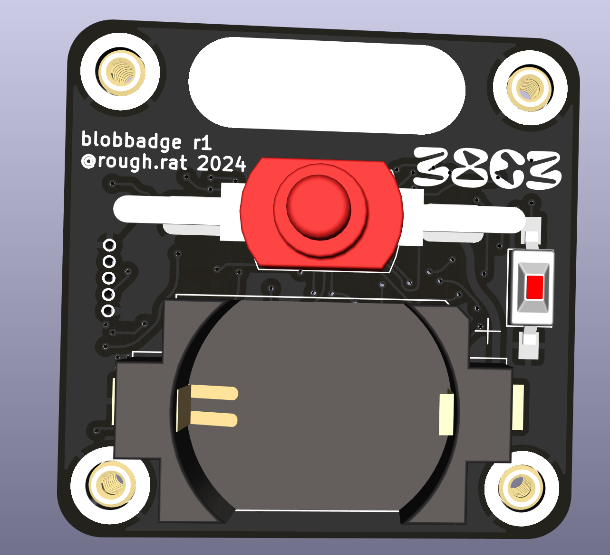
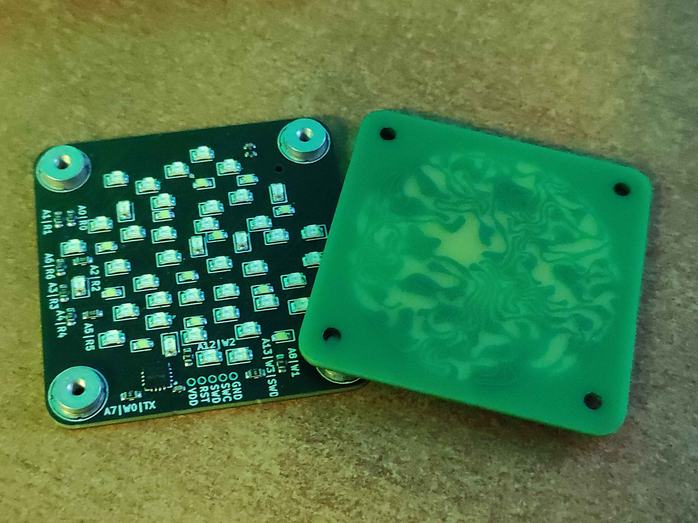

# Blobbadge

This is a backlight badge. It charlieplexes LEDs with PY32F002.

## IRL

The prototype front has been made as green, to speed up / optimize the development.

Proof of concept firmware, freshly rewritten in rust

https://github.com/rough-rat/blobbadge-rs
